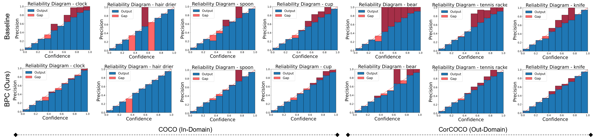

# [CVPR 2023] Bridging Precision and Confidence: A Train-Time Loss for Calibrating Object Detection

[Paper Link](arxivlink)

Authors: [Muhammad Akhtar Munir](https://scholar.google.com.pk/citations?user=sT-epZAAAAAJ&hl=en), [Muhammad Haris Khan](https://scholar.google.com.pk/citations?user=ZgERfFwAAAAJ&hl=en), [Salman Khan](https://salman-h-khan.github.io/), [Fahad Shahbaz Khan](https://scholar.google.es/citations?user=zvaeYnUAAAAJ&hl=en)

This paper is accepted at CVPR 2023 and this repositoy contains the PyTorch implementation of our proposed Bridging Precision and Confidence (BPC) loss with D-DETR.

## Abstract
Deep neural networks (DNNs) have enabled astounding progress in several vision-based problems. Despite showing high predictive accuracy, recently, several works have revealed that they tend to provide overconfident predictions and thus are poorly calibrated. The majority of the works addressing the miscalibration of DNNs fall under the scope of classification and consider only in-domain predictions. However, there is little to no progress in studying the calibration of DNN-based object detection models, which are central to many vision-based safety-critical applications. In this paper, inspired by the train-time calibration methods, we propose a novel auxiliary loss formulation that explicitly aims to align the class confidence of bounding boxes with the accurateness of predictions (i.e. precision). Since the original formulation of our loss depends on the counts of true positives and false positives in a minibatch, we develop a differentiable proxy of our loss that can be used during training with other application-specific loss functions.



Reliability Diagrams: Selected classes from MS-COCO (In-Domain) and CorCOCO (Out-Domain). Top: Baseline trained as D-DETR and Bottom: D-DETR trained with our proposed BPC loss.

## Results

### BPC calibration loss comparison with baseline, post-hoc and other train-time calibration losses
Results report Detection Expected Calibration Error (D-ECE) for In-Domain (MS-COCO) and Out-Domain (CorCOCO).

| Methods                                                      | D-ECE (MS-COCO) | APbox (MS-COCO) |    D-ECE (CorCOCO)    | APbox (CorCOCO) | model | 
|--------------------------------------------------------------|:---------:|:----------:|:---------:|:------:|:------:|
| [Baseline](https://arxiv.org/abs/2010.04159)                 |   12.8   |   44.0    |   10.8   |   23.9    | [link](https://drive.google.com/file/d/1q45sjir00jcTDgYf1zrGWyiAy8MQT9JF/view?usp=share_link)     |
| [Temp. Scaling](https://arxiv.org/abs/1706.04599)            |   14.2   |   44.0    |   12.3   |   23.9   |  -   |
| [MDCA](https://arxiv.org/abs/2203.13834)                     |   12.2   |   44.0    |   11.1   |   23.5   |   [link](https://drive.google.com/file/d/1CsXpzU55fMKrQzQ6EUmkZAGmzgo60eTE/view?usp=share_link)  |
| [MbLS](https://arxiv.org/abs/2111.15430)                     |   15.7   |   44.4    |   12.4   |   23.5    |  [link](https://drive.google.com/file/d/1U_-5QK036hCskMXeUMkSTc98iTg1fkR8/view?usp=share_link)    |
| [BPC (Ours)](arXiv)                                          |   **10.3**   |   43.7    |   **9.4**    |   23.2    |   [link](https://drive.google.com/file/d/15JX77MfXoLRPLbzekTfbcevigfz_GDoO/view?usp=share_link)   |


## Setup

Requirements: This implementation is on:

Linux, CUDA>=11.0

Python>=3.7

PyTorch>=1.7.0

## Installation

For complete Installation, and usage instructions, follow guidelines [here](https://github.com/fundamentalvision/Deformable-DETR#installation)

## Training and Evaluation

### Training on single node

For example, the command for training BPC loss with Deformable DETR on <#GPUs> is as following:

```
GPUS_PER_NODE=<#GPUs> ./tools/run_dist_launch.sh <#GPUs> ./configs/r50_deformable_detr.sh
```

### Training on slurm cluster

If you are using slurm cluster, you can run the following command to train on 1 node with <#GPUs>:

```
GPUS_PER_NODE=<#GPUs> ./tools/run_dist_slurm.sh <partition> deformable_detr <#GPUs> configs/r50_deformable_detr.sh
```

### Evaluation

Config file and pretrained model available in the above section of Results, run following command to evaluate

```bash
<path to config file> --resume <path to pre-trained model> --eval
```

## Citation

Please cite the following, if you find this work useful in your research:
```bibtex
@article{munir2023bridging,
  title={Bridging Precision and Confidence: A Train-Time Loss for Calibrating Object Detection},
  author={ Munir, Muhammad Akhtar and Khan, Muhammad Haris and Khan, Salman and Khan, Fahad},
  journal={IEEE Conference on Computer Vision and Pattern Recognition (CVPR)},
  year={2023}
}
```

## Contact
In case of any query, create issue or contact akhtar.munir@mbzuai.ac.ae 

## Acknowledgement
This codebase is built on <a href="https://github.com/fundamentalvision/Deformable-DETR">Deformable-DETR</a> and <a href="https://github.com/rafaelpadilla/Object-Detection-Metrics">Object Detection Metrics</a>

